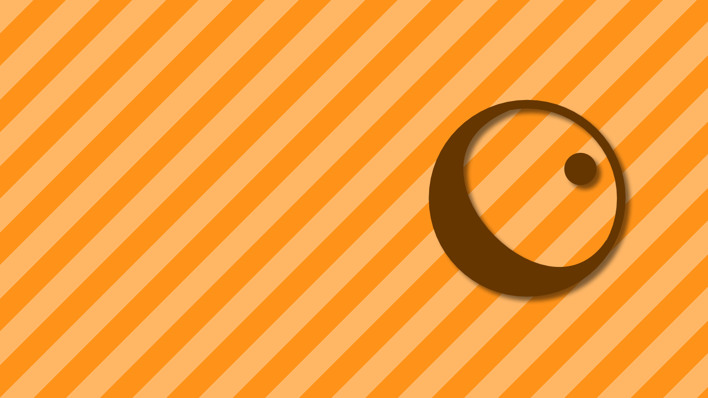

# Cel Shading

## Overview
This repository contains a collection of shaders used to demonstrate cel-shading in Unity. The project structure contains completed and template versions of each shader - the reader is intended to follow the [Cel Shading tutorial series](https://danielilett.com/2019-05-29-tut2-intro/) to complete the template files.

### Shaders Included
Several shaders are included, each of which builds on the last, resulting in the final complete cel shader. Some shaders are available in multiple formats (Unity surface shader or traditional fragment/vertex shader).
- Diffuse Lighting - `DiffuseSurf.shader`, `DiffuseFrag.shader`;
- Cel-shaded Lighting - `CelShadedSurf.shader`, `CelShadedFrag.shader`;
- Fresnel/Rim Lighting - `RimCelShaded.shader`;
- Outlined - `OutlineCelShaded.shader`.

### Assets
This project uses the Unity Standard Assets.

## Software
This project was created using Unity 2019.1. It should work if upgraded or downgraded to other versions, although this is not officially supported.

## Authors
This repository was created by [Daniel Ilett](https://danielilett.com/).

## Release
These shaders and the corresponding tutorial series were released initially on May 29th. Updates are planned to conclude on June 19th.

Thanks for reading my tutorials.
❤
